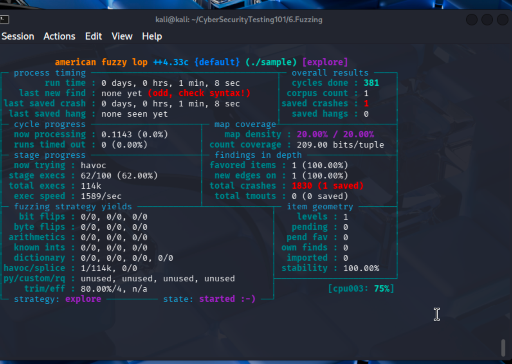

# Task 2 -- Final Answers

------------------------------------------------------------------------

## 1. Screenshot of AFL++ Execution

Insert your screenshot below:



------------------------------------------------------------------------

## 2. Required Commands to Complete This Task

### 1. Install AFL++

``` bash
sudo apt update && sudo apt install afl++
```

### 2. Compile the Binary with AddressSanitizer

``` bash
AFL_USE_ASAN=1 afl-cc -o sample sample.c
```

### 3. Create Input/Output Directories and Seed File

``` bash
mkdir inputs outputs
echo "initial test string" > inputs/seed.txt
```

### 4. Run AFL++

``` bash
afl-fuzz -i inputs -o outputs -- ./sample @@
```

### 5. Reproduce the Crash to View ASAN Output

``` bash
./sample outputs/default/crashes/id:000000*
```

------------------------------------------------------------------------

## 3. AddressSanitizer Output Analysis

### Does it identify the line of code?

Yes.

The stack trace shows:

    main ... sample.c:16:9

This indicates execution reached **line 16** in `sample.c`.\
It also identifies that the overflowed variable is `buffer`, originally
declared on **line 6**.

### What other information does it provide?

-   Vulnerability type: **stack-buffer-overflow**\
-   Violation: `WRITE of size 61`\
-   The 50-byte buffer was overrun by 11 bytes\
-   It provides a shadow memory map\
-   It shows the write into protected redzone memory

------------------------------------------------------------------------

## 4. Crash Statistics

**Total crashes found:**

    2560

**Unique crashes:**

    1

AFL++ filters duplicate crashes automatically, so the saved crashes
count represents unique vulnerabilities.

------------------------------------------------------------------------

## 5. Cycles Information

**Cycles done:**

    536

A cycle means AFL++ processed every test case in its queue and applied
its full mutation strategy once.

------------------------------------------------------------------------

## 6. When Should You Stop the Fuzzer?

You should stop when:

-   The cycles indicator turns green\
-   No new paths are discovered after a long run\
-   No new crashes are found for hours/days\
-   Code coverage stops increasing

At that point, the fuzzer has likely exhausted meaningful mutations.

------------------------------------------------------------------------

## 7. Current Fuzzing Strategy

**Strategy:**

    havoc

The havoc stage applies aggressive random mutations like:

-   Bit flips\
-   Byte overwrites\
-   Insertions\
-   Deletions\
-   Stacked mutations
