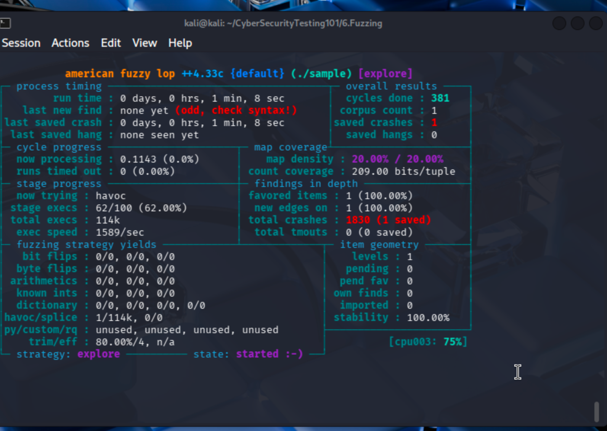

# Task 2 -- Final Answers

------------------------------------------------------------------------

## 1. Screenshot of AFL++ Execution

Insert your screenshot below:



------------------------------------------------------------------------

## 2. Required Commands to Complete This Task

### 1. Install AFL++

``` bash
sudo apt update && sudo apt install afl++
```

### 2. Compile the Binary with AddressSanitizer

``` bash
AFL_USE_ASAN=1 afl-cc -o sample sample.c
```

### 3. Create Input/Output Directories and Seed File

``` bash
mkdir inputs outputs
echo "initial test string" > inputs/seed.txt
```

### 4. Run AFL++

``` bash
afl-fuzz -i inputs -o outputs -- ./sample @@
```

### 5. Reproduce the Crash to View ASAN Output

``` bash
./sample outputs/default/crashes/id:000000*
```

------------------------------------------------------------------------

## 3. AddressSanitizer Output Analysis

### Does it identify the line of code?

Yes.

The stack trace shows:

    main ... sample.c:16:9

This indicates execution reached **line 16** in `sample.c`.\
It also identifies that the overflowed variable is `buffer`, originally
declared on **line 6**.

### What other information does it provide?

-   Vulnerability type: **stack-buffer-overflow**\
-   Violation: `WRITE of size 61`\
-   The 50-byte buffer was overrun by 11 bytes\
-   It provides a shadow memory map\
-   It shows the write into protected redzone memory

------------------------------------------------------------------------

## 4. Crash Statistics

**Total crashes found:**

    2560

**Unique crashes:**

    1

AFL++ filters duplicate crashes automatically, so the saved crashes
count represents unique vulnerabilities.

------------------------------------------------------------------------

## 5. Cycles Information

**Cycles done:**

    536

A cycle means AFL++ processed every test case in its queue and applied
its full mutation strategy once.

------------------------------------------------------------------------

## 6. When Should You Stop the Fuzzer?

You should stop when:

-   The cycles indicator turns green\
-   No new paths are discovered after a long run\
-   No new crashes are found for hours/days\
-   Code coverage stops increasing

At that point, the fuzzer has likely exhausted meaningful mutations.

------------------------------------------------------------------------

## 7. Current Fuzzing Strategy

**Strategy:**

    havoc

The havoc stage applies aggressive random mutations like:

-   Bit flips\
-   Byte overwrites\
-   Insertions\
-   Deletions\
-   Stacked mutations
# Challenge: Retrieve the Language File That Never Made It Into Production

------------------------------------------------------------------------

## 1. The Process and Adaptation

By inspecting the **Network tab** in the browser's Developer Tools while
changing the application's language, I discovered that Juice Shop
fetches translation files via the `/assets/i18n/` endpoint (e.g.,
`en.json`).

To find the hidden language file, I decided to fuzz this endpoint using
**ffuf**.

### Initial Issues

Running a large, generic wordlist caused two major problems:

#### 1. Server Instability

The high default request rate crashed the Node.js server (Denial of
Service).

#### 2. Wildcard Responses

The Angular Single Page Application (SPA) returned:

    200 OK (75055 bytes)

for every non-existent file, which rendered standard fuzzing
ineffective.

------------------------------------------------------------------------

### Adaptation Strategy

To solve this, I:

-   Created a **targeted custom wordlist** containing language codes\
-   Applied **rate limiting** (`-rate 30`) to protect the server\
-   Used a **size filter** (`-fs 75055`) to ignore SPA catch-all
    responses\
-   Reduced thread count (`-t 5`) for stability

This made the fuzzing precise and controlled.

------------------------------------------------------------------------

## 2. Required Commands and Code

### Step 1 -- Create Custom Wordlist

``` bash
cat <<EOF > langs.txt
en
es
fr
de
fi
zh_CN
ru_RU
tlh_AA
pt_BR
EOF
```

------------------------------------------------------------------------

### Step 2 -- Execute Adapted ffuf Command

``` bash
ffuf -w langs.txt \
-u http://127.0.0.1:3000/assets/i18n/FUZZ.json \
-mc 200 \
-fs 75055 \
-t 5 \
-rate 30
```

------------------------------------------------------------------------

## 3. Results

The command successfully filtered out wildcard responses and identified
valid language files:

    en      [Status: 200, Size: 33094, Words: 3871, Lines: 484, Duration: 7ms]
    zh_CN   [Status: 200, Size: 31056, Words: 1681, Lines: 484, Duration: 1ms]
    ru_RU   [Status: 200, Size: 49348, Words: 3698, Lines: 484, Duration: 1ms]
    tlh_AA  [Status: 200, Size: 32711, Words: 3846, Lines: 484, Duration: 4ms]
    pt_BR   [Status: 200, Size: 35187, Words: 4043, Lines: 484, Duration: 1ms]

The hidden file was:

    tlh_AA.json

Browsing directly to:

    http://127.0.0.1:3000/assets/i18n/tlh_AA.json

confirmed the file and solved the challenge.

------------------------------------------------------------------------

## Conclusion

This challenge demonstrated:

-   Understanding SPA wildcard behavior\
-   Identifying and filtering false positives\
-   Rate-limiting to prevent self-inflicted DoS\
-   Creating targeted wordlists\
-   Precision fuzzing with ffuf

The hidden language file was successfully retrieved and validated.
